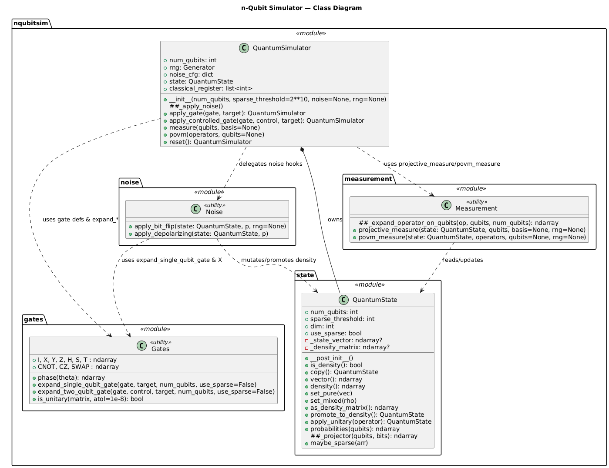

## Architecture overview
In this file the architecture of the code is explained. To help explaining a sequence diagram, a UML class diagram and flowcharts are given.

### Sequence diagram
Sequence Diagrams are interaction diagrams that detail how operations are carried out. They capture the interaction between objects in the context of a collaboration. Sequence Diagrams are time focus and they show the order of the interaction visually by using the vertical axis of the diagram to represent time what messages are sent and when. In our sequence diagram the user performs the actions in the example python script "simulation.py". The lines show communication between objects, with solid lines for requests and dashed lines for returns.

  

### UML

  

### Flowcharts
Flowcharts are used to visualize the internal logic of key functions in the quantum simulator. They show the sequence of operations, decision points, and state updates within individual algorithms, such as quantum measurement and gate application.

In this project, flowcharts are included for the more complex functions to clarify how probabilities are computed and how the quantum state is updated during the simulation.

  

